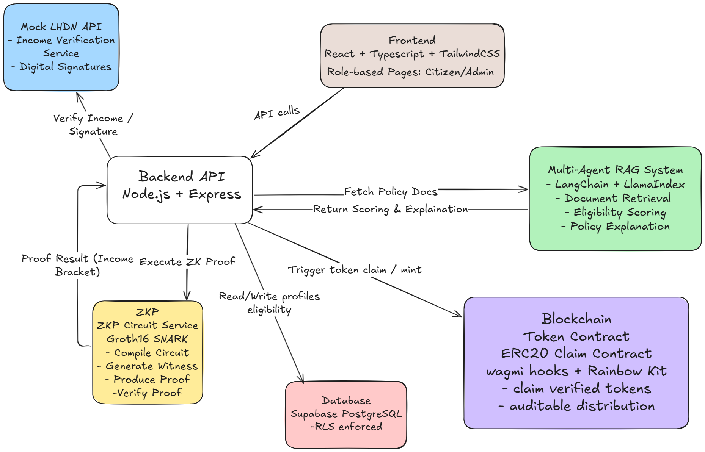
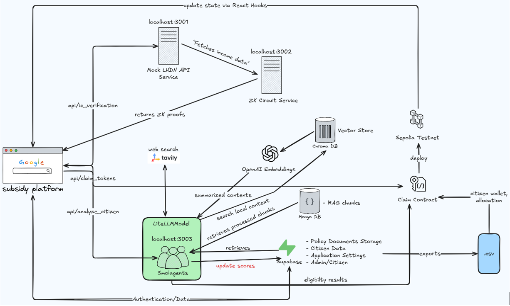
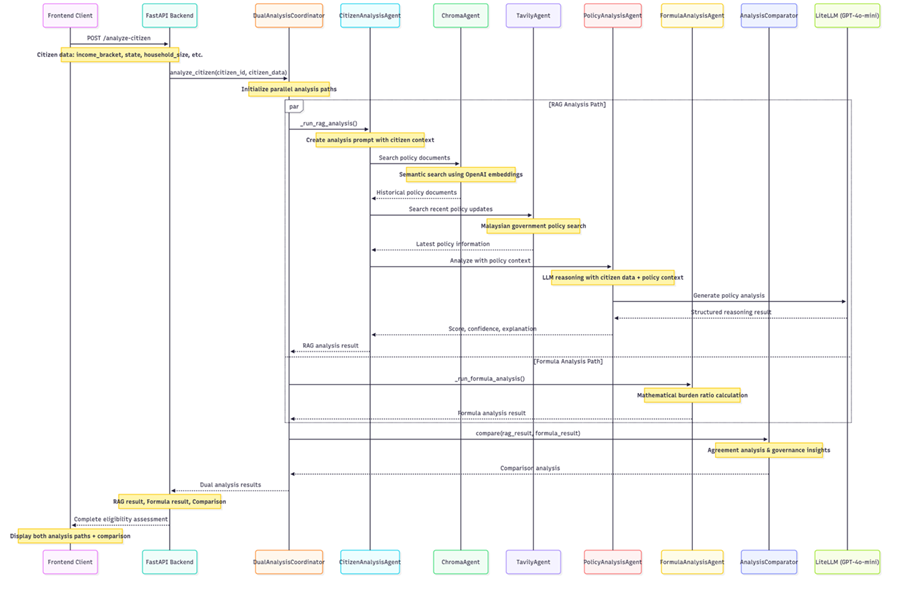
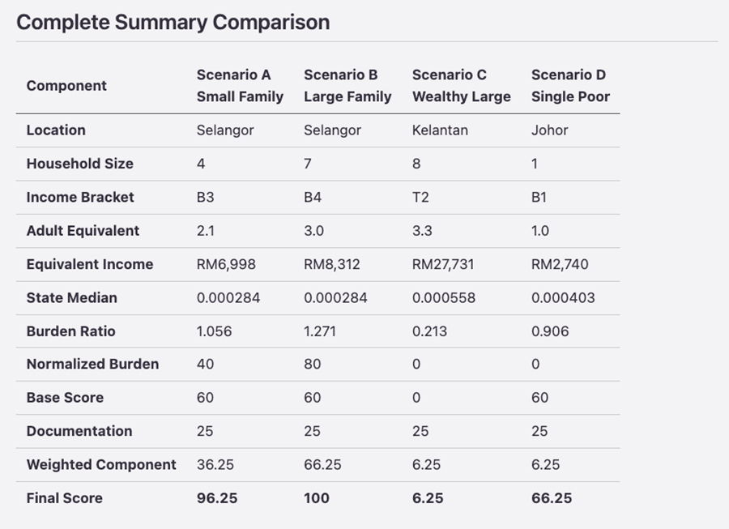
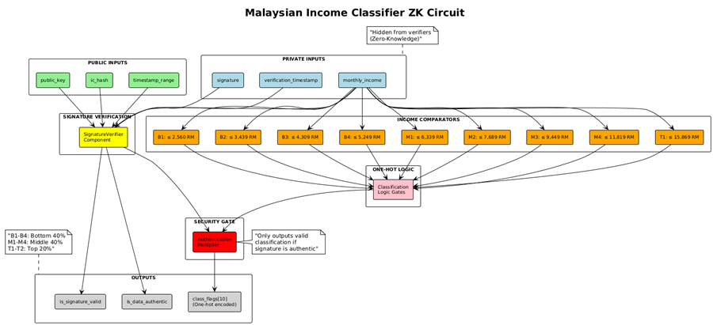
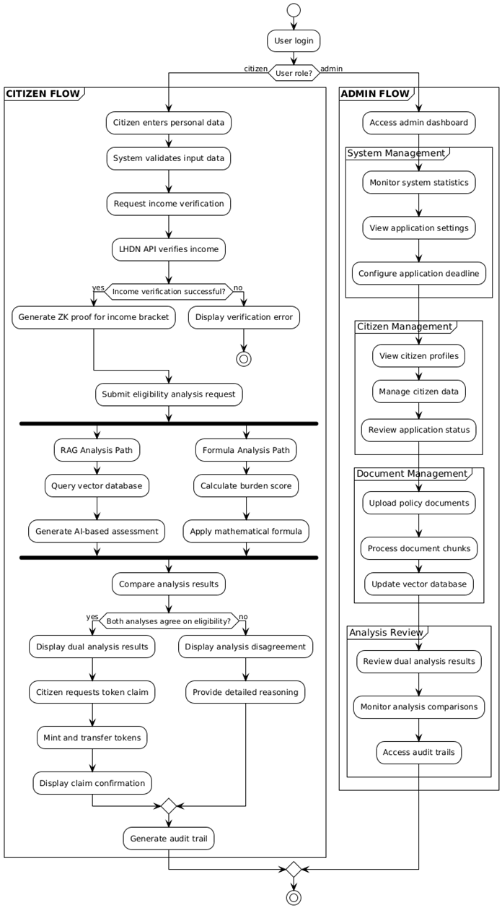

## A Multi-Agent RAG System for Auditable Token Distribution

**Project Type:** Final Year Project (FYP)
**Technologies:** React, TypeScript, TailwindCSS, Supabase, Node.js, Express, ZK-SNARK (Groth16), Circom, Solidity (ERC20), Mock API (Swagger UI), FastAPI

---

## Table of Contents

1. [Project Overview](#project-overview)
2. [Core Features](#core-features)
3. [Architecture](#architecture)
4. [Demo Flow](#demo-flow)
5. [Installation & Setup](#installation--setup)
6. [Future Work](#future-work)
7. [License](#license)

---

## Project Overview

This project implements a **multi-agent RAG (Retrieval-Augmented Generation) system** integrated with **zero-knowledge proofs (ZKP)** to enable **auditable and privacy-preserving token distribution**. The system allows users to prove their eligibility for a token-based subsidy (or scholarship) **without revealing sensitive income data**.

Key goals:

* Showcase **technical strength** in full-stack development, ZKP, and multi-agent AI frameworks.
* Provide a **privacy-preserving, auditable workflow** for conditional token distribution.
* Deliver a **reusable system** suitable for educational or NGO contexts.

---

## Core Features ✅ COMPLETED

* **Front-end**:

  * React + TypeScript + Vite
  * TailwindCSS styling and Lucide React icons
  * Role-based pages: Citizen, Admin, ZK Demo
  * Real-time ZK proof display and status badges
  * Dual-analysis results interface with tabbed views

* **Back-end**:

  * Node.js + Express servers for Mock LHDN API and ZK circuit service
  * Supabase for user authentication and database storage
  * Row-Level Security (RLS) ensures users can only access their own profiles
  * FastAPI smolagents service for multi-agent analysis

* **Zero-Knowledge Proof (ZKP)**:

  * Groth16 SNARKs implemented in Circom
  * Income classification without revealing exact income
  * Proof verification via backend service

* **Token Distribution**:

  * ERC20 contract integration for token issuance (MMYRCToken + SubsidyClaim)
  * Deployed on Sepolia testnet with Etherscan verification:
    - **MMYRCToken**: [`0x61B6056de59844cBc3A4eC44963D9619e4914F20`](https://sepolia.etherscan.io/address/0x61B6056de59844cBc3A4eC44963D9619e4914F20)
    - **SubsidyClaim**: [`0xeF79df53ae0d09b0219da032170Bf9F502d94009`](https://sepolia.etherscan.io/address/0xeF79df53ae0d09b0219da032170Bf9F502d94009)
  * Blockchain wallet connection and airdrop functionality
  * End-to-end demonstration of claim after ZKP verification

* **Multi-Agent RAG System** ✅ **IMPLEMENTED**:

  * **Dual-Analysis Architecture**: RAG-based vs Formula-based comparison
  * **CitizenAnalysisAgent**: AI-powered policy reasoning with context retrieval
  * **FormulaAnalysisService**: Transparent burden-score calculation
  * **AnalysisComparator**: Agreement/disagreement detection for governance insights
  * **ChromaDB Integration**: Semantic search in policy document corpus
  * **Comprehensive Testing**: Synthetic datasets and comparative analysis validation

---

## Architecture Evolution

### Initial Design

*Original concept showing basic multi-agent RAG integration*

### Complete Implementation

*Fully implemented system with dual-analysis architecture*

### Additional System Views

| Component | Diagram | Description |
|-----------|---------|-------------|
| **Multi-Agent Flow** |  | Complete agentic orchestration workflow |
| **Burden Score Formula** |  | Mathematical burden calculation methodology |
| **ZK Circuit Design** |  | Zero-knowledge proof circuit architecture |
| **Activity Diagram** |  | Complete user interaction flow |
| **ZK Architecture** |  | Zero-knowledge system design |

**Key Implementation Notes:**

* **Zero-Knowledge Proofs**: Enable income bracket verification without revealing exact figures using Groth16 SNARKs
* **Dual-Analysis Architecture**: RAG-based flexible reasoning vs Formula-based transparent calculations
* **State-Aware Burden Calculation**: Uses real HIES data with state-specific income equivalents and median burden values
* **Multi-Agent RAG System**: ChromaDB semantic search with LiteLLM model integration for policy reasoning

---

## Demo Flow ✅ COMPLETED

1. **Register / Login** using Supabase Auth
2. **Fill Profile** (name, date of birth, gender, wallet address, household info)
3. **IC Verification** → Backend retrieves income data from Mock LHDN
4. **ZK Proof Generation** → Generates proof for income bracket (e.g., B40/M40-M1)
5. **Multi-Agent Analysis** → Dual analysis using both RAG and formula-based approaches
6. **View Results** → Tabbed interface showing comparison, RAG reasoning, and formula breakdown
7. **Token Claim** → Connect wallet and claim tokens after eligibility verification

---

## Burden Score Formula Implementation

### Mathematical Foundation

The system implements a sophisticated **state-aware burden calculation** using real Malaysian HIES (Household Income and Expenditure Survey) data:

#### Core Formula
```
Final Score = min(100, (0.75 × Burden Score + 0.25 × Documentation Score) + Base Score)
```

#### Key Components

1. **Adult Equivalent (AE) Calculation**
   ```
   AE = 1 + 0.5 × (Adults - 1) + 0.3 × Children
   ```

2. **Applicant Burden**
   ```
   Applicant Burden = AE / Equivalent Income
   ```

3. **Burden Ratio (State-Relative)**
   ```
   Burden Ratio = Applicant Burden / State Median Burden
   ```

4. **Piecewise Burden Scoring**
   - BR ≤ 1.0 → 50 points (below state median)
   - 1.0 < BR ≤ 1.2 → 70 points (moderately above)
   - 1.2 < BR ≤ 1.5 → 90 points (significantly above)
   - BR > 1.5 → 100 points (much higher than median)

#### Implementation Files

- **Backend Logic**: `backend/smolagents-service/tools/eligibility_score_tool.py`
- **Frontend Calculations**: `frontend/src/utils/formulaCalculations.ts`
- **Documentation**: `backend/smolagents-service/docs/complete_scoring_process.md`

#### State-Specific Data

| State | Median Burden | Economic Context |
|-------|---------------|------------------|
| W.P. Kuala Lumpur | 0.000263 | Capital (richest) |
| Selangor | 0.000284 | Industrial hub |
| Johor | 0.000403 | Manufacturing center |
| Kedah | 0.000458 | Agricultural state |
| Kelantan | 0.000558 | Rural (poorest) |

*Complete state data available in `backend/smolagents-service/docs/data_cleaning/hies_cleaned_state_percentile.csv`*

#### Research Validation

The dual-analysis architecture demonstrates:
- **Formula-based**: Transparent, auditable mathematical calculations
- **RAG-based**: Contextual policy reasoning with semantic document retrieval
- **Comparison Analysis**: Agreement/disagreement detection for governance insights

---

## Installation & Setup

**Prerequisites:**

* Node.js >= 20
* npm >= 9
* Docker (optional, for local DB)

**Clone the repository:**

```bash
git clone https://github.com/BLTC-520/gov-subsidy-platform.git
cd gov-subsidy-platform
```

**Install dependencies:**

```bash
# Frontend
cd frontend
npm install
npm run dev

# Backend (Mock LHDN + ZK service)
cd ../backend/mock-lhdn-api
npm install
npm start

cd ../zk-service
npm install
npm start

root -> ./startallservices.sh
```

---

## Future Work

**All core development completed. Future enhancements focus on real-world deployment:**

* **Real Data Integration**: Replace mock LHDN API with actual government data sources
* **MYRC Cooperation**: Integrate with Malaysian government systems (MyKad, e-Kasih, BR1M databases)
* **Production Deployment**: Scale system for real scholarship/subsidy distribution programs
* **Enhanced Security**: Add advanced encryption, audit trails, and compliance features
* **Multi-Agency Support**: Extend to support multiple government agencies and policy frameworks

---

## License

MIT License


